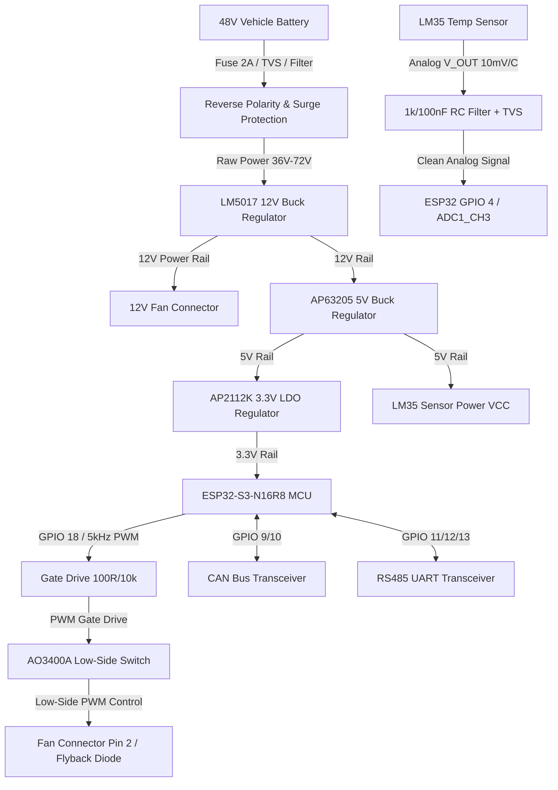

# RayGlides 3W/4W EV Kit Cooling Controller — System Block Diagram

## 1. System Block Diagram (Mermaid)

## 2. Power-Distribution Hierarchy
1.  **48V Nominal Input Stage**: Accepts unregulated voltage from the main lithium traction pack (range: 36V to 72V). Bypasses automotive load-dumps and switching ripple via a robust TVS-clamped passive pi-network filter.
2.  **12V Intermediate Power Stage**: Generated via TI's LM5017 100V-input synchronous buck regulator. This rail supplies the 12V DC brushless fan directly and serves as the input to the secondary 5V regulator.
3.  **5V Logic Power Stage**: Generated via Diodes Inc. AP63205 synchronous buck regulator from the 12V rail. Powering the LM35 sensor from 5V ensures linear operating headroom for the analog outputs.
4.  **3.3V Microcontroller Stage**: Generated via Diodes Inc. AP2112K-3.3 high-accuracy LDO regulator from the 5V rail. This isolates the sensitive analog-to-digital converter (ADC) references from any transient switching noise generated by the ESP32 module's RF operations.
